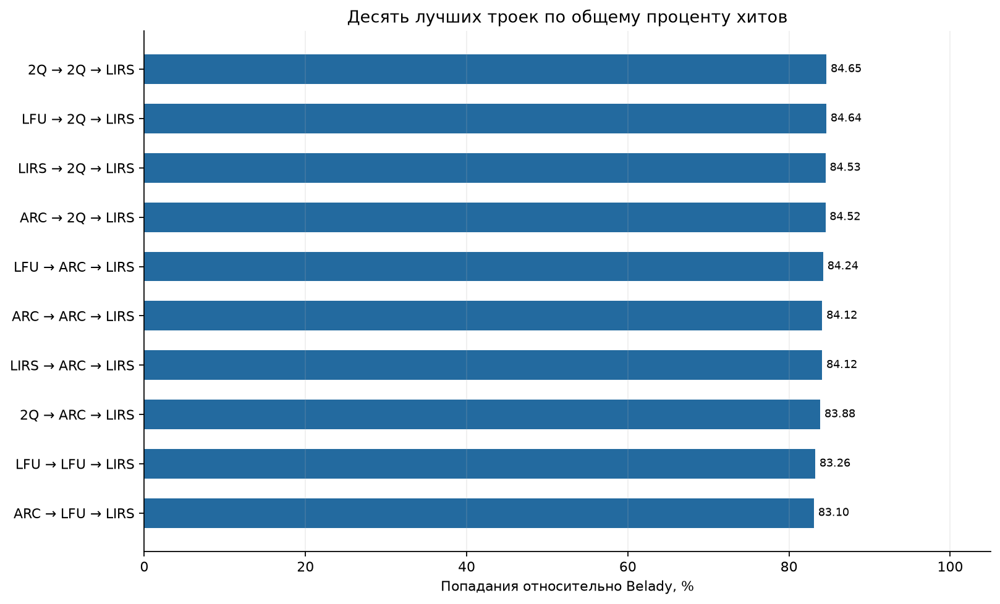
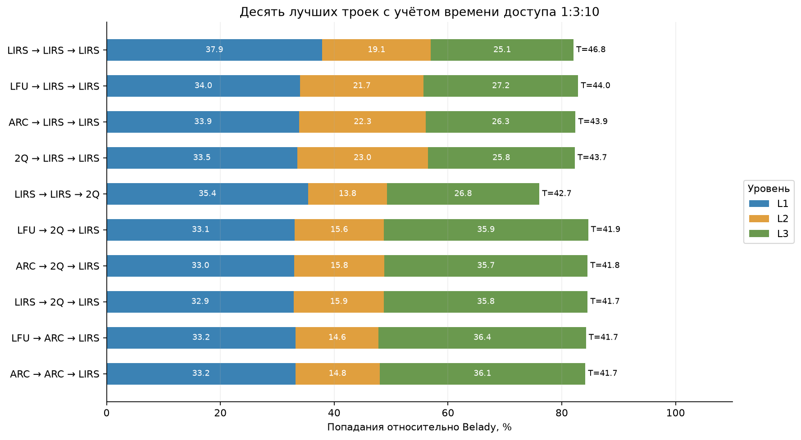
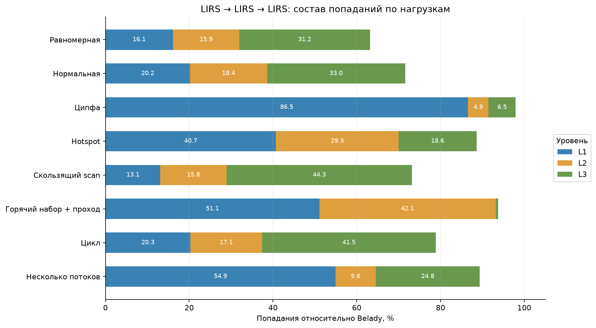
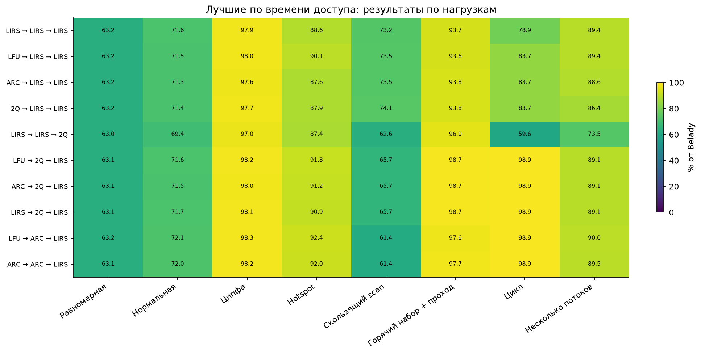

# Cache research

**Cache research** - проект на C++, посвящённый исследованию алгоритмов кэширования и построению оптимальной трёхуровневой системы кэшей.

## Содержание

- [Сборка](#сборка)
- [Использование](#использование)
- [Алгоритмы кэширования](#алгоритмы-кэширования)
    - [LFU](#lfu-least-frequently-used)
    - [2Q](#2q-two-queues)
    - [ARC](#arc-adaptive-replacement-cache)
    - [LIRS](#lirs-low-inter-reference-recency-set)
    - [Belady](#belady-ideal-cache)
- [Инклюзивная многоуровневая система кэшей](#инклюзивная-многоуровневая-система-кэшей)
- [Тестирование](#тестирование)
- [Структура проекта](#структура-проекта)
- [Исследование трёхуровневой системы](#исследование-трёхуровневой-системы)
    - [Рейтинг по общему проценту попаданий](#рейтинг-по-общему-проценту-попаданий)
    - [Рейтинг с учётом времени доступа](#рейтинг-с-учётом-времени-доступа)
    - [Результаты по нагрузкам](#результаты-по-нагрузкам)
    - [Вывод](#вывод)
- [Запуск исследования](#запуск-исследования)

## Сборка

Требования:

- CMake 3.16 или новее;
- компилятор с поддержкой C++20.

Установка инструментов сборки:

```bash
sudo apt update
sudo apt install build-essential cmake git
```

Клонирование репозитория и сборка проекта:

```bash
git clone https://github.com/andreyphm/Cache_research.git
cd Cache_research
cmake -S . -B build
cmake --build build
```

## Использование

Общий формат команды:

```bash
./build/cache_research.out <config-file>
```

Файл конфигурации задаёт число уровней и алгоритмы кэширования на каждом из уровней: `LFU`, `ARC`, `2Q` или `LIRS` от верхнего уровня к нижнему.
Через стандартный ввод передаются ёмкости всех уровней от верхнего к нижнему, число запросов и ключи. Число ёмкостей должно совпадать с числом уровней, сами ёмкости не могут уменьшаться от верхнего уровня к нижнему.

Программа выводит количество попаданий.

Пример содержимого файла конфигурации:

```text
2
LFU ARC
```

Пример ввода:

```text
2 4 4
1 2 1 2
```

## Алгоритмы кэширования

### LFU (Least Frequently Used)

Реализация: [`headers/LFU_cache.hpp`](headers/LFU_cache.hpp).

#### Устройство

Кэш содержит один список, элементы упорядочены по убыванию частоты обращений. Среди элементов с одинаковой частотой недавно использованные находятся ближе к началу. Размер кэша фиксирован.

#### Поиск

Ключ ищется в хеш-таблице. При попадании частота увеличивается на единицу, запись перемещается на соответствующее место в списке.

#### Вставка

После загрузки данных новый элемент добавляется в конец списка с частотой `0`. Затем частота увеличивается до `1`, а элемент перемещается перед остальными элементами с данной частотой.

#### Вытеснение

При заполненном кэше перед вставкой нового элемента удаляется последний элемент списка - с наименьшей частотой, при совпадении частот удаляется элемент с наиболее давним временем последнего обращения.

### 2Q (Two Queues)

Реализация: [`headers/2Q_cache.hpp`](headers/2Q_cache.hpp).

#### Устройство

Кэш содержит две очереди: очередь новых элементов `A1in` и очередь повторно загруженных элементов `Am`. В `A1in` элементы упорядочены по времени вставки, в `Am` - по времени последнего обращения. Отдельно хранится ghost-очередь `A1out` - ограниченная история ключей, вытесненных из `A1in`, не содержащая данных. Размеры кэша и ghost-списка фиксированы. Заданы два параметра: `kin` - рекомендуемый размер `A1in`, используется при выборе элемента для вытеснения; `kout` - максимальный размер ghost-списка.

#### Поиск

Ключ ищется в хеш-таблице. При попадании в `A1in` порядок элементов не меняется. При попадании в `Am` найденный элемент перемещается в начало очереди.

#### Вставка

После загрузки данных новый элемент добавляется в начало `A1in`. Если ключ найден в `A1out`, данные загружаются повторно, освобождается место в кэше, а элемент переносится в начало `Am`.

#### Вытеснение

При заполненном кэше выбор зависит от размера `A1in`. Если он превышает `kin`, последний элемент `A1in` переносится в начало `A1out` без сохранения данных. Иначе удаляется последний элемент `Am` без сохранения ключа. При вставке нового ключа, если история уже содержит `kout` элементов, перед переносом удаляется ключ, который раньше остальных был перенесён в `A1out`.

### ARC (Adaptive Replacement Cache)

Реализация: [`headers/ARC_cache.hpp`](headers/ARC_cache.hpp).

#### Устройство

Кэш содержит два списка: список недавно добавленных элементов `T1` и список повторно использованных элементов `T2`. В `T1` элементы упорядочены по времени вставки, в `T2` - по времени последнего обращения. Отдельно хранятся ghost-списки `B1` и `B2` - истории ключей, вытесненных из `T1` и `T2` соответственно, не содержащие данных. В ghost-списках ключи упорядочены по времени переноса в историю, недавно перенесённые находятся ближе к началу.

Размер кэша `capacity` фиксирован. Задан параметр `target_t1_size_` - рекомендуемый размер `T1`, используется при выборе элемента для вытеснения. Начальное значение параметра равно `capacity / 2`, его значение ограничено диапазоном от `0` до `capacity`. Суммарный размер `T1` и `B1` не превышает `capacity`, суммарный размер всех четырёх списков не превышает `2 * capacity`.

#### Поиск

Ключ ищется в хеш-таблице. При попадании в `T1` или `T2` элемент переносится в начало `T2`.

#### Вставка

После загрузки данных новый элемент добавляется в начало `T1`, при необходимости предварительно освобождается место в кэше.

Если ключ найден в `B1` или `B2`, данные загружаются повторно. При восстановлении из `B1` параметр `target_t1_size_` увеличивается на единицу, при восстановлении из `B2` - уменьшается на единицу. После изменения параметра освобождается место в кэше, а элемент переносится в начало `T2`.

#### Вытеснение

При заполненном кэше выбор зависит от размера `T1`. Если он превышает `target_t1_size_`, вытесняется последний элемент `T1` - с наиболее давним временем вставки. При восстановлении из `B2` непустой список `T1` выбирается также при равенстве его размера `target_t1_size_`. В остальных случаях вытесняется последний элемент `T2` - с наиболее давним временем последнего обращения. Данные удаляются, а ключ переносится в начало соответствующего ghost-списка: из `T1` в `B1`, из `T2` в `B2`.

При вставке нового ключа, если размер `T1` равен `capacity`, последний элемент `T1` удаляется без сохранения ключа в истории. Если суммарный размер `T1` и `B1` равен `capacity`, но размер `T1` меньше `capacity`, перед вытеснением удаляется последний ключ `B1` - с наиболее давним временем переноса в историю. В остальных случаях, если суммарный размер всех четырёх списков равен `2 * capacity`, перед вытеснением по тому же критерию удаляется последний ключ `B2`.

### LIRS (Low Inter-reference Recency Set)

Реализация: [`headers/LIRS_cache.hpp`](headers/LIRS_cache.hpp).

#### Устройство

Кэш содержит две группы элементов: `LIR` - элементы, не участвующие в непосредственном вытеснении, и `HIR` - элементы, из которых выбирается кандидат на вытеснение. Стек `S` содержит все элементы `LIR`, часть элементов `HIR` с данными и ключи вытесненных элементов `HIR` без данных. В `S` элементы упорядочены по времени последнего обращения, недавно использованные находятся ближе к началу. Очередь `Q` содержит только элементы `HIR` с данными; добавление и перемещение элементов выполняются в начало очереди, вытеснение - с конца.

Размер кэша `capacity` фиксирован. Максимальное число элементов `LIR` задаётся как `lir_capacity_ = capacity * 99 / 100`. Оставшиеся резидентные позиции используются элементами `HIR`. Размер стека `S` отдельным параметром не ограничен.

#### Поиск

Ключ ищется в хеш-таблице. При попадании в `LIR` элемент перемещается в начало `S`, после чего выполняется очистка стека - с его конца последовательно удаляются элементы `HIR` до первого элемента `LIR`.

При попадании в `HIR` с данными, если элемент присутствует в `S`, он перемещается в начало стека, удаляется из `Q` и переводится в группу `LIR`. Элемент `LIR` с наиболее давним временем последнего обращения переводится в группу `HIR` и переносится из конца `S` в начало `Q`. Затем выполняется очистка стека.

Если элемент `HIR` с данными отсутствует в `S`, он добавляется в начало стека и перемещается в начало `Q` без изменения группы.

#### Вставка

После загрузки данных, если число элементов `LIR` меньше `lir_capacity`, новый элемент добавляется в начало `S` как `LIR`. Иначе новый элемент добавляется в начало `S` и `Q` как `HIR`, при необходимости предварительно освобождается место в кэше.

Если ключ присутствует в `S` без данных, данные загружаются повторно, элемент перемещается в начало стека и переводится в группу `LIR`. Элемент `LIR` с наиболее давним временем последнего обращения переводится в группу `HIR` и переносится из конца `S` в начало `Q`, при необходимости предварительно освобождается место в очереди. Затем выполняется очистка стека.

#### Вытеснение

При заполненном кэше перед добавлением элемента в `Q` удаляется последний элемент очереди без сохранения данных. Если его ключ присутствует в `S`, он сохраняется в истории. Иначе ключ удаляется из хеш-таблицы.

При очистке стека элементы с данными сохраняются в `Q`, ключи без данных удаляются из хеш-таблицы.

### Belady (Ideal cache)

Реализация: [`headers/belady_cache.hpp`](headers/belady_cache.hpp).

#### Устройство

Кэш содержит один список, элементы упорядочены по времени вставки. Для каждого элемента хранится позиция следующего обращения `next_use_`. Если обращений больше не будет, используется специальное значение `never`, заведомо большее любого числа типа std::size_t. Размер кэша `capacity` фиксирован.

Конструктор получает всю последовательность запросов, для каждого ключа заранее строится очередь позиций его обращений.

#### Поиск

Перед поиском текущая позиция удаляется из очереди обращений к ключу. Следующая позиция берётся из начала очереди, если очередь пуста - используется `never`.

Ключ ищется в хеш-таблице. При попадании обновляется `next_use_`, порядок элементов в списке не меняется.

#### Вставка

После загрузки данных новый элемент добавляется в конец списка вместе с позицией следующего обращения, при необходимости предварительно освобождается место в кэше.

#### Вытеснение

При заполненном кэше список просматривается целиком. Удаляется элемент с наибольшим значением `next_use_` - тот, который понадобится позже остальных. Элементы, к которым больше не будет обращений, вытесняются в первую очередь; если таких несколько, выбирается первый из них. Данные удаляются вместе с ключом из хеш-таблицы кэша, очередь будущих обращений сохраняется.

## Инклюзивная многоуровневая система кэшей

Система представляет собой последовательность уровней от самого верхнего к нижнему. Число уровней задаётся конфигурацией. Для каждого уровня независимо выбирается один из алгоритмов кэширования и указывается собственная ёмкость.

Ёмкости не могут уменьшаться сверху вниз, поскольку система поддерживает инклюзивность: если данные находятся в L1, их копии обязательно присутствуют в L2 и L3; если данные находятся в L2, копия обязательно присутствует в L3. Общее число различных резидентных ключей во всей иерархии ограничено ёмкостью самого нижнего кэша.

### Обработка запроса

Каждый запрос сначала поступает в L1. Если ключ найден, запрос завершается и нижние уровни не просматриваются. При промахе L1 обращается к L2, затем по той же схеме запрос может перейти в L3 и далее в хранилище.

Попаданием считается первый уровень, на котором найдены данные:

- при попадании в L1 запрос учитывается только как попадание L1;
- при промахе L1 и попадании L2 запрос учитывается только как попадание L2;
- при промахах L1 и L2 и попадании L3 запрос учитывается только как попадание L3;
- если ключ отсутствует во всех кэшах, выполняется загрузка из хранилища и фиксируется общий промах.

Таким образом, число попаданий всей системы равно сумме попаданий L1, L2 и L3. Один запрос не может одновременно учитываться как попадание нескольких уровней.

### Заполнение уровней

После нахождения или загрузки данных результат возвращается вверх по пройденному пути. Каждый уровень, на котором произошёл промах, сохраняет полученные данные. Например:

- попадание L2 приводит к вставке копии данных в L1;
- попадание L3 приводит к вставке копии данных в L2 и L1;
- загрузка из хранилища приводит к вставке копии данных во все уровни.

Если вставка требует освобождения места, каждый уровень самостоятельно выбирает жертву по правилам своего алгоритма. Политики и их служебное состояние независимы: частота LFU, очереди ARC и 2Q, а также группы LIRS одного уровня не влияют непосредственно на другой уровень.

### Вытеснение и инвалидация

Вытеснение из верхнего уровня не изменяет нижние уровни. Например, после удаления ключа из L1 его копии могут продолжать находиться в L2 и L3, поэтому последующий запрос способен попасть в один из них и снова заполнить L1.

Вытеснение из нижнего уровня требует обратного действия. Если L3 удаляет ключ, все его копии в L2 и L1 немедленно инвалидируются. Если ключ удаляется из L2, удаляется также копия L1, но копия L3 сохраняется.

Это правило не позволяет верхнему кэшу хранить данные, которых уже нет ниже, и сохраняет инклюзивность после любых вытеснений. Исторические записи без данных, используемые ARC, 2Q и LIRS, не считаются резидентными копиями, не занимают ёмкость данных и не являются попаданиями.

### Состояние алгоритмов на разных уровнях

Нижний уровень видит только запросы, завершившиеся промахом на всех предыдущих уровнях. Поэтому обращение, попавшее в L1, не обновляет частоту или давность использования копий в L2 и L3. Аналогично попадание L2 не обновляет состояние L3.

Из-за этого один ключ может считаться часто используемым в L1, но старым или редким в L3. Если нижний уровень вытеснит такой ключ, верхние копии будут инвалидированы независимо от их локальной популярности. Взаимодействие локальных политик замещения и каскадных инвалидаций является основной особенностью исследуемой системы.

## Тестирование

Тесты используют **GoogleTest 1.17.0** и запускаются через **CTest**. Конфигурация находится в [`tests/CMakeLists.txt`](tests/CMakeLists.txt).

### Запуск всех тестов

Команды выполняются из корня проекта после сборки проекта и тестов.

Для CMake/CTest **3.20 и новее**:

```bash
ctest --test-dir build --output-on-failure
```

Для CMake/CTest **3.16-3.19**:

```bash
(cd build && ctest --output-on-failure)
```

### Запуск тестов указанной цели

`<target>` - одна из целей (`ARC` / `LFU` / `2Q` / `LIRS` / `belady` / `interface`)

Для CMake/CTest **3.20 и новее**:

```bash
ctest --test-dir build -L <target> --output-on-failure
```

Для CMake/CTest **3.16-3.19**:

```bash
(cd build && ctest -L <target> --output-on-failure)
```

## Структура проекта

```text
Cache_research/
├── headers/
│   ├── 2Q_cache.hpp            # 2Q кэш
│   ├── ARC_cache.hpp           # ARC кэш
│   ├── LFU_cache.hpp           # LFU кэш
│   ├── LIRS_cache.hpp          # LIRS кэш
│   ├── belady_cache.hpp        # Belady кэш
│   ├── benchmark_runner.hpp    # запуск исследования
│   ├── cache_runner.hpp        # запуск многоуровневой системы
│   ├── config.hpp              # конфигурация уровней
│   └── SlowGetPage.hpp         # источник данных для кэшей
├── source/
│   ├── benchmark_main.cpp      # внутренний интерфейс запуска одной трассы
│   ├── benchmark_runner.cpp    # выполнение исследования на одной трассе
│   ├── cache_runner.cpp        # многоуровневая система кэшей
│   ├── config.cpp              # разбор файла конфигурации
│   └── main.cpp                # консольный интерфейс
├── tests/
│   ├── 2Q_tests.cpp            # тесты 2Q
│   ├── ARC_tests.cpp           # тесты ARC
│   ├── LFU_tests.cpp           # тесты LFU
│   ├── LIRS_tests.cpp          # тесты LIRS
│   ├── belady_tests.cpp        # тесты Belady
│   ├── interface_tests.cpp     # тесты интерфейса
│   └── CMakeLists.txt          # сборка и регистрация тестов
├── benchmarks/
│   ├── figures/                # графики исследования
│   ├── scripts/                # генерация, запуск, обработка данных
│   ├── data/                   # входные .txt (создаются локально)
│   └── results/                # результаты .csv (создаются локально)
└── CMakeLists.txt              # сборка программы и тестов
```

## Исследование трёхуровневой системы

Сравниваются все 64 упорядоченные тройки LFU, ARC, 2Q и LIRS, включая повторения алгоритмов. Ёмкости уровней равны C, 2C и 4C, где C = 64, 256 или 1024; эталон — один Belady с ёмкостью 4C. Длина каждой трассы равна 120C: 7680, 30720 или 122880 запросов соответственно. Кэши начинают пустыми, учитываются все запросы. Основная оценка рейтинга — `100 × hits / belady_hits`.

Для каждого уровня дополнительно сохраняется число попаданий `Lk_hits`. Сумма попаданий L1, L2 и L3 равна общему числу попаданий иерархии.

Для случайных нагрузок используются seed 1-5. Для детерминированных нагрузок выполняется один запуск.

| Нагрузка | Параметры |
| --- | --- |
| Равномерная | Независимый выбор из W = 8C ключей |
| Нормальная | W = 8C, математическое ожидание 4C, стандартное отклонение 2C; значения вне диапазона генерируются повторно |
| Ципфа | W = 8C, вес ранга r равен 1/r^1,2 |
| Hotspot | W = 8C; 80% запросов к горячим H = 2C ключам |
| Скользящий scan | Последовательные окна шириной 6C со сдвигом 1,5C; соседние окна перекрываются на 4,5C |
| Горячий набор + проход | 4C запросов к H = 2C горячим ключам, затем проход по 4C новым ключам |
| Цикл | Последовательный проход по W = 6C ключей, повторяемый 20 раз |
| Несколько потоков | Zipf(α=1), циклический проход и Hotspot(p=0,9), отдельные множества по 4C ключей; доли 1:1:1 |

Всего создаётся 96 трасс и выполняется 6 144 запуска иерархии. Scan и цикл детерминированы, остальные нагрузки используют seed 1–5. Все тройки и Belady получают одну и ту же последовательность для данного сценария и seed. История ключей без данных не считается попаданием и не входит в ёмкость C.

Рейтинг рассчитывается так: среднее по seed → среднее по трём ёмкостям → среднее по восьми нагрузкам.

### Рейтинг по общему проценту попаданий

Лучшей стала **2Q → 2Q → LIRS**: 84,65% от попаданий Belady. Ближайшая тройка LFU → 2Q → LIRS получила 84,64%; разница — 0,01 процентного пункта.



### Рейтинг с учётом времени доступа

Время обращения к L1, L2 и L3 принимается в отношении 1:3:10. Оценка рассчитывается как
`100 × (L1_hits + L2_hits / 3 + L3_hits / 10) / belady_hits`. Чем выше значение, тем больше попаданий приходится на быстрые уровни.

Конфигурации отсортированы по взвешенной оценке `T`, указанной справа. Цветные сегменты показывают доли попаданий L1, L2 и L3 относительно Belady; их сумма равна общему проценту попаданий системы.



Для победителя **LIRS → LIRS → LIRS** отдельно показан состав попаданий на каждой нагрузке.



### Результаты по нагрузкам

По вертикали расположены десять конфигураций из рейтинга времени доступа. В ячейках указан их общий процент попаданий относительно Belady на каждой нагрузке.



### Вывод

Если учитывать только суммарные попадания, то первое место в рейтинге занимает **2Q → 2Q → LIRS** с результатом 84,65% от Belady. Следующая конфигурация, LFU → 2Q → LIRS, получила 84,64%. Разница около 0,01 процентного пункта меньше наблюдаемого разброса между seed, поэтому эти два результата практически эквивалентны в рамках проведённого эксперимента.

Первые четыре места общего рейтинга занимают системы с 2Q в L2 и LIRS в L3; меняется только алгоритм L1. Кроме того, все десять лидеров используют LIRS на третьем уровне. Это указывает, что для максимизации общего числа попаданий решающую роль играет нижняя часть иерархии: LIRS хорошо удерживает данные, дошедшие до L3, а 2Q в L2 отделяет повторно используемые ключи от однократных и последовательных обращений.

При временах доступа L1:L2:L3 = 1:3:10 лидирует **LIRS → LIRS → LIRS** с оценкой T = 46,75. Второе место занимает LFU → LIRS → LIRS с T = 43,95, преимущество первой системы в рейтинге составляет около 2,80 T. При этом LIRS → LIRS → LIRS находится только на 16-м месте по общему числу попаданий с результатом 82,05%, а победитель общего рейтинга 2Q → 2Q → LIRS занимает 17-е место по времени доступа с оценкой T = 41,32.

Причина различия видна в распределении попаданий по уровням. У LIRS → LIRS → LIRS относительно Belady в среднем 37,87% попаданий приходится на L1, 19,12% — на L2 и 25,06% — на L3. У 2Q → 2Q → LIRS распределение равно 32,24%, 16,49% и 35,92% соответственно - система получает больше попаданий, но заметно большая их часть происходит в медленном L3.

Особенно хорошо различие критериев показывает **LIRS → LIRS → 2Q**. По общему числу попаданий эта система занимает только 32-е место из 64 с результатом 76,05% от Belady. Однако во временном рейтинге она находится на пятом месте с оценкой T = 42,72. Её попадания распределяются как 35,43% в L1, 13,83% в L2 и 26,80% в L3.

Результат также зависит от характера нагрузки. На распределении Ципфа LIRS → LIRS → LIRS обрабатывает через L1 около 86,5% попаданий Belady благодаря устойчивой группе популярных ключей. На скользящем scan и цикле значительная часть попаданий переносится в L3: около 44,3% и 41,5% соответственно. Эти нагрузки превышают возможности верхних уровней и проверяют сохранение данных при последовательном вытеснении. На нагрузке «горячий набор + проход» основная часть попаданий распределяется между L1 и L2, а вклад L3 остаётся минимальным.

Итоговый выбор зависит от цели. Для максимального общего hit rate предпочтительны конфигурации с 2Q в L2 и LIRS в L3. Если стоимость обращения к нижним уровням существенно выше, наиболее выгодна LIRS → LIRS → LIRS. Выводы относятся к выбранным нагрузкам, ёмкостям C, 2C и 4C, холодному начальному состоянию, выбранному отношению времён доступа и инклюзивной схеме с каскадной инвалидацией.

## Запуск исследования

Для исследования нужны Python 3.10+ и библиотеки для графиков:

```bash
python -m pip install matplotlib numpy
cmake -S . -B build -DCMAKE_BUILD_TYPE=Release
cmake --build build --config Release --target research
```

Цель `research` собирает внутреннюю программу обработки трасс, генерирует нагрузки, сравнивает 64 тройки с Belady и строит графики. Она доступна, если CMake нашёл Python 3.10 или новее. При необходимости путь к интерпретатору задаётся через `-DPython3_EXECUTABLE=...`. Повторный запуск заменяет результаты CSV и графики.

Параметры находятся в [suite.json](benchmarks/scripts/suite.json). `generators.py` создаёт последовательности, `run.py` запускает C++, `report.py` сохраняет сводные CSV и графики PNG. Справка по скриптам доступна через `--help` у `run.py` и `report.py`.

Файлы трасс сохраняются непосредственно в `benchmarks/data`, результаты — в `benchmarks/results`, графики — в `benchmarks/results/figures`. Для сохранения отдельного эксперимента укажите `run.py --output <каталог> --data <каталог>`, затем `report.py --results <каталог>`.
